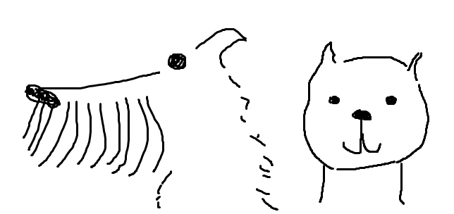

# O pejskovi a koèièce 

V domeèku spolu �ili pejsek a koèièka, chovali se jako lidé. Chodili spolu na procházky, vedli malou domácnost, umıvali špinavou podlahu, pekli dort, nebo psaly dopisy dìtem.
Jeliko� však pejsek s koèièkou nebyli lidmi, nedopadlo v�dy všechno tak jak by si pøedstavovali. Jejich zpùsob øešení však pùsobil originálnì a zábavnì. 

## Jak si myli podlahu 

Koèièka si všimnula, �e podlaha je pøíliš špinavá. Spolu s pejskem se rozhodli, �e ji umyjí. Pejsek šel napustit vodu, zatímco koèièka polo�ila na stùl mıdlo. Poté odešla do komùrky, zøejmì pro uzenou myš. 
	Jakmile se navrátil pejsek i s nepuštìnou vodou, zpozoroval �e na stole je cosi hezkého rù�ového. Pomyslel si �e je to sır, naèe� onen pøedmìt vlo�il do úst. Znenadání se mu z talmi zaèala øinout pìna. Jakmile se koèièka navrátila, objasnila mu �e pozøel mıdlo. Šla tedy koupit nové. 
	Kdy� pøišla zpátky i s novım mıdlem, uvìdomila si �e nemají �ádnı kartáè. Povšimla si však podobnosti pejskovy srsti, je� byla témìø toto�ná s kartáèem. Popadla tak pejska a vydrhla s ním podlahu. Ovšem podlahu bylo tøeba usušit, a tak pejsek popadl koèièku a usušil jí podlahu. Po tomto úkonu byla sice podlaha èistá, avšak pro zmìnu pejsek s koèièkou byli špinaví. 
	Oba dva se tedy navzájem vyprali. Poté se zavìsili na šòùru, kde chtìli vyschnout. Jen�e jejich plán pøekazil déš�. Sundali se tedy ze šòùry a utíkali se chovat. Za chvíli pøestalo pršet. Opìt vylezli na šòùru, ale vzápìtí se déš� znovu vrátil a tak museli vše zopakovat. 
	Nakonec kdy� veèer vyschli, shodli se na tom �e prádlo sklidí, naèe� si vlezli do košíku, kde usnuli. 

**O pejskovi a koèièce, autor pùvodního textu: Josef Èapek; parafrázováno** 

